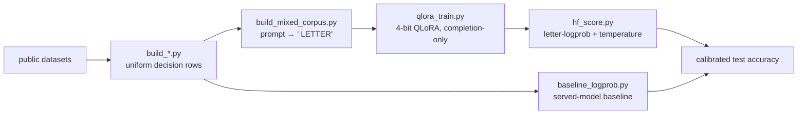

# system-one-bench

Methodology and tooling for **measuring and building open "System One" decision models** —
models that take unstructured state plus a per-request question and option set, and return one
calibrated choice in a single forward pass, with no text generation.

This repository is written to be **reproduced and reused**, not to advertise a result. If you are
researching fast option-scoring models, calibration, or held-out generality, the parts worth
copying are the **benchmark construction**, the **letter-logprob scoring + calibration protocol**,
and the **recorded pitfalls** — the training recipe is just one point in that design space.

---

## Pretrained weights — [`yocoms/system1-qlora`](https://huggingface.co/yocoms/system1-qlora)

Two QLoRA adapters (Qwen3-0.6B and Qwen3-4B-Instruct-2507), same recipe, on the Hub.
Held-out test accuracy / ECE, vs frozen **Jev 1.13**:

| benchmark | 0.6B | 4B | Jev 1.13 |
|---|---|---|---|
| SNI (semantic / NLI) | 0.613 / .037 | **0.707** / .050 | 0.838 |
| reflex (safety) | **0.553** / .059 | **0.558** / .072 | 0.543 |
| BFCL (tool select) | 0.885 / .032 | 0.920 / .034 | 0.957 |
| abstention (none-fits) | **0.960** / .019 | **0.924** / .035 | 0.740 |

Latency ~53 ms (0.6B) / ~165 ms (4B) per answer — 20× / 6.5× faster than Jev. We beat Jev on
reflex and abstention, and closed most of the SNI gap once we found it was a **format** mismatch:
the held-out NLI tasks are "pick which of 3 candidates is neutral", not single-pair label
classification. Rebuilding NLI in that select-of-3 format (`harness/build_nli_select.py`) lifted
`mnli_neutral` 0.16 → 0.88 on the 0.6B. See `docs/FINDINGS.md`.

## The task

A "System One" decision (the contract popularised by TypeSafe's closed **Jev**) is:

> unstructured `state` + `question` + `options[]`  →  one option, with a calibrated probability,
> in a **single forward pass**, no generation.

The question set and the option set arrive **per request** and can be anything, so a useful model
must generalise to **questions and predicates it never saw in training**, not just new inputs for
a fixed label set. That distinction drives every design choice here.

---

## What's in here

| Piece | What it is |
|---|---|
| **3 benchmarks** | `SNI held-out-predicate` (generality), `reflex` (math + code), `BFCL` (tool selection) — all in one `{state, question, options, answer_index}` schema |
| **A scoring protocol** | option **letter-logprob** in one forward pass + **temperature calibration** fit on val, never test |
| **Baselines** | zero-training logprob scoring from a large served model; a 270M LoRA scorer |
| **A training recipe** | mixed-corpus **QLoRA** where the SFT objective *is* the eval metric |
| **`docs/FINDINGS.md`** | a dated lab journal of every measurement, including the ones that were wrong first |
| **`docs/PITFALLS.md`** | rules that each exist because breaking one produced a wrong number |
| **`web/`** | a small Astro site: a results dashboard and a live "try a decision" page |

---

## Methodology

### 1. Scoring: option letter-logprob, one forward pass

Every row is rendered to one fixed prompt:

```
State:
<state>

Question:
<question>

Options:
A. <option 0>
B. <option 1>
...

Answer:
```

The model does **one forward pass**; we read the next-token log-probability of each option's
letter (` A`, ` B`, …), softmax over the *present* options, and take the argmax as the decision
and the max probability as confidence. No sampling, no generation, deterministic.

Two things that are easy to get wrong (see `docs/PITFALLS.md`):

- Score through the **raw completion endpoint**, not a chat template — a reasoning template injects
  tokens before the letter and the score reads position 0.
- **Never renormalise over only the options you received.** A truncated top-logprobs list drops
  options; a missing option is *reported as missing*, not silently dropped, because renormalising
  produces a clean, confident, wrong distribution.

`harness/baseline_logprob.py` scores an already-served model this way; `harness/hf_score.py` scores
a local Hugging Face model (base + LoRA) with the identical prompt and token.

### 2. Calibration

Temperature is fit on the **validation** split by minimising NLL and applied unchanged to test.
It is never fit on the rows being scored. Accuracy, ECE and Brier are all reported post-calibration.

### 3. Benchmark construction

- **SNI held-out-predicate** (`harness/build_sni.py`, from Natural Instructions). The point is
  generality: the train/test split is **category-disjoint**, so the *predicates* in the test set
  never appear in training (verified `train ∩ test = ∅`). A model that only memorised its training
  label sets scores at chance here. This is the benchmark that separates generalisation from recall.
- **reflex** (`harness/build_reflex.py`): math topic (7-way), math level (5-way ordinal) from MATH,
  and code-vulnerability (yes/no) — decisions a fast model should make reflexively.
- **BFCL tool-calling** (`harness/build_bfcl.py`, from `llamastack/bfcl_v3`): which function to call,
  with a `None of the above` sentinel. **Held out of all training by policy** — training on a
  benchmark destroys the ability to report it, so BFCL only ever measures zero-shot transfer.

### 4. Training recipe

The SFT objective is made **identical to the eval metric**: each decision becomes
`prompt → ' <correct letter>'`, and the model is QLoRA-fine-tuned (4-bit NF4, LoRA, completion-only
loss) to maximise the correct letter's probability after the exact scoring prompt
(`harness/build_mixed_corpus.py`, `harness/qlora_train.py`). Because a single-domain scorer does
**not** transfer across domains (measured — see findings), the corpus is **mixed** across every
in-domain distribution at once.



---

## Results

One model was trained with this recipe (Qwen3-4B-Instruct-2507, QLoRA, ~33M trainable params,
one 16 GB GPU). Reported as calibrated test accuracy. **These are single-seed numbers on one
hardware setup; treat them as a worked example of the protocol, not a leaderboard.**

| benchmark | n | floor | prior open scorer | large model, prompted | this recipe (4B) |
|---|---:|---|---:|---:|---:|
| SNI held-out-predicate | 1950 | majority 0.534 | 0.472 | — | **0.672** |
| reflex (math + code) | 600 | — | — | 0.385 | **0.580** |
| BFCL tool-calling | 399 | — | — | 0.937 | **0.937** (zero-shot) |

The "large model, prompted" column is a 35B MoE scored through the identical letter-logprob path.
Full per-task tables and the running journal are in `docs/FINDINGS.md`.

---

## Reproduce

```bash
# 1. Build the benchmarks from public sources (writes to data/, which is gitignored)
python harness/build_sni.py
python harness/build_reflex.py
python harness/build_bfcl.py

# 2. Baseline: score a model you already serve (set LLAMA_SERVER_URL)
LLAMA_SERVER_URL=http://localhost:11435 \
  python harness/baseline_logprob.py --data-dir data/reflex --endpoint completion --workers 1

# 3. Build the mixed SFT corpus and train (needs a working GPU torch; see below)
python harness/build_mixed_corpus.py
python harness/qlora_train.py --base Qwen/Qwen3-4B-Instruct-2507 --out results/model_lora

# 4. Score the trained model with the same protocol as the baselines
python harness/hf_score.py --base Qwen/Qwen3-4B-Instruct-2507 \
  --adapter results/model_lora --datasets sni reflex bfcl --out results/eval.json
```

**Environment.** Training/eval need a GPU torch build. This project ran on AMD (gfx1100) via the
`rocm/pytorch` container with `bitsandbytes` for 4-bit; the scripts are hardware-agnostic (they
use `device_map={"":0}`), so a CUDA torch works unchanged. `docs/FINDINGS.md` records the exact
ROCm container setup, including the rootless-podman `memlock` gotcha and a CPU-frequency thermal
control that mattered on this box.

`data/` is intentionally gitignored — it is derived from public datasets and regenerated by the
`build_*` scripts. Only small result JSONs are committed.

---

## Limitations (please read before citing)

- **Single seed, one hardware setup.** No variance estimates; the numbers illustrate the protocol.
- **Small test splits** (hundreds–2k rows). Enough to separate signal from chance, not for tight CIs.
- **Known weak spots** of the trained model: **abstention** ("None of the above" on tool-calling)
  and **code-vulnerability** detection (near coin-flip). Both are visible in the results and the
  `web/` hard-case gallery; neither is hidden.
- **The recipe is one point in the design space.** The benchmark construction and scoring protocol
  are the reusable contribution; the specific base model and corpus are swappable.

---

## Data provenance & licensing

- SNI: [Natural Instructions](https://github.com/allenai/natural-instructions) (per-task licenses).
- BFCL: [`llamastack/bfcl_v3`](https://huggingface.co/datasets/llamastack/bfcl_v3), Apache-2.0.
- reflex: [MATH](https://github.com/hendrycks/math) + a public code-vulnerability set.

Code in this repo is released under the **MIT License** (see `LICENSE`). Datasets and base models
keep their own upstream licenses; regenerate `data/` yourself rather than redistributing it.

## Repository layout

```
harness/   build_*.py (benchmarks) · baseline_logprob.py · qlora_train.py ·
           hf_score.py · serve.py (model HTTP server) · demo.py · run_hard.py
docs/      FINDINGS.md (lab journal) · PITFALLS.md (hard-won rules)
web/       Astro results dashboard + live trial page
results/   small evaluation JSONs (the numbers above)
```
